Setup Instructions
Steps
1.Clone the Repository
git clone https://github.com/vanipriya98/newsapp.git

2.Navigate to the Project Directory

3.Install Dependencies using npm install or if any errors related dependencies use this 
"npm i --legacy-peer-deps"

4.Serve the Application - ng serve

## Note : If the maximum number of requests to the API per day is exceeded, it will lead to errors in the API response.

## WebPage Screebshots

# Home Page 
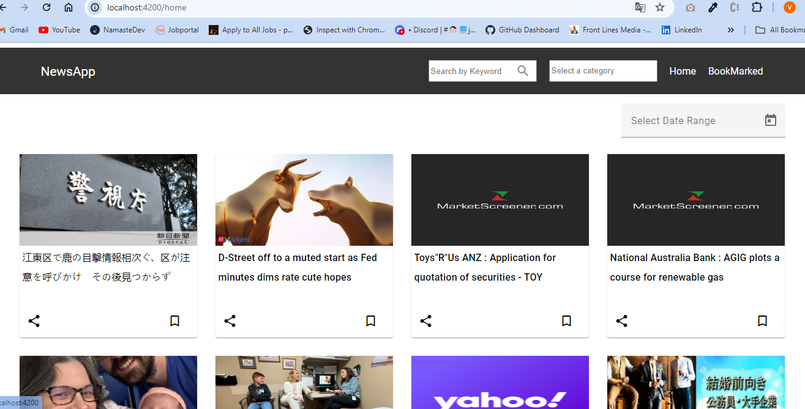
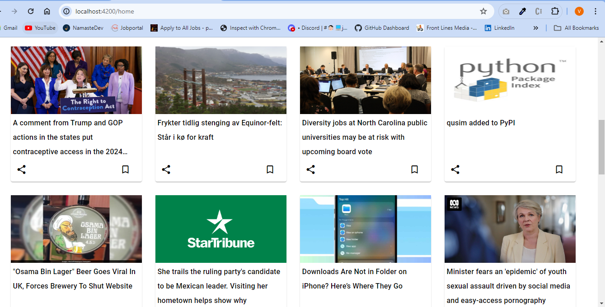

# Filters Screenshots 

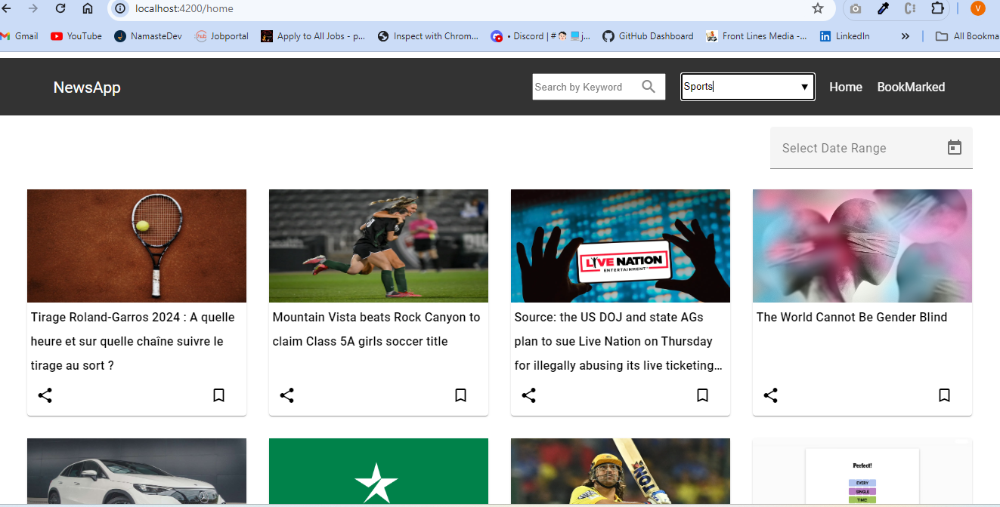
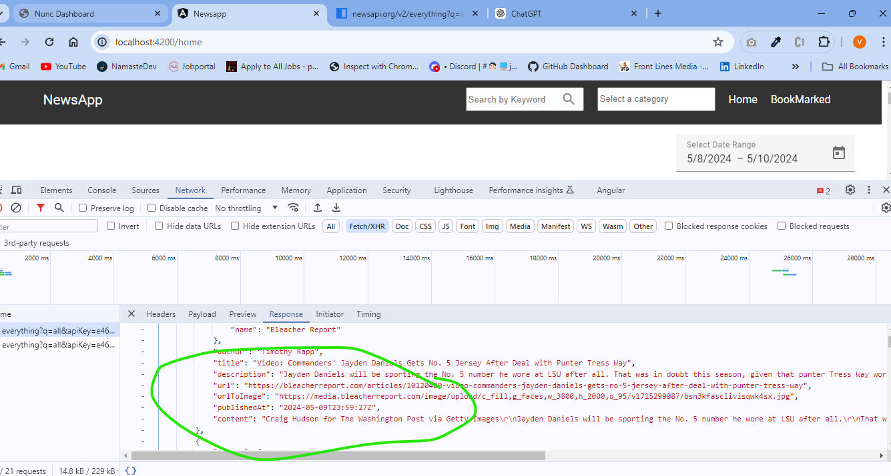
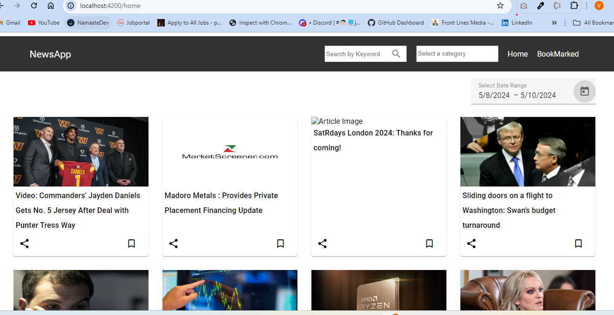

# Bookmarking a Article
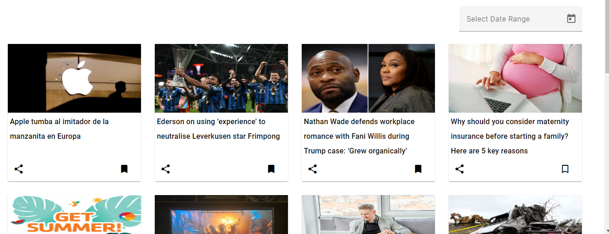
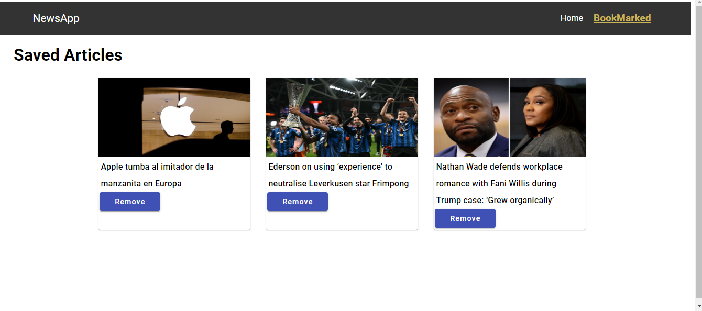

# Responsive Design Screenshots
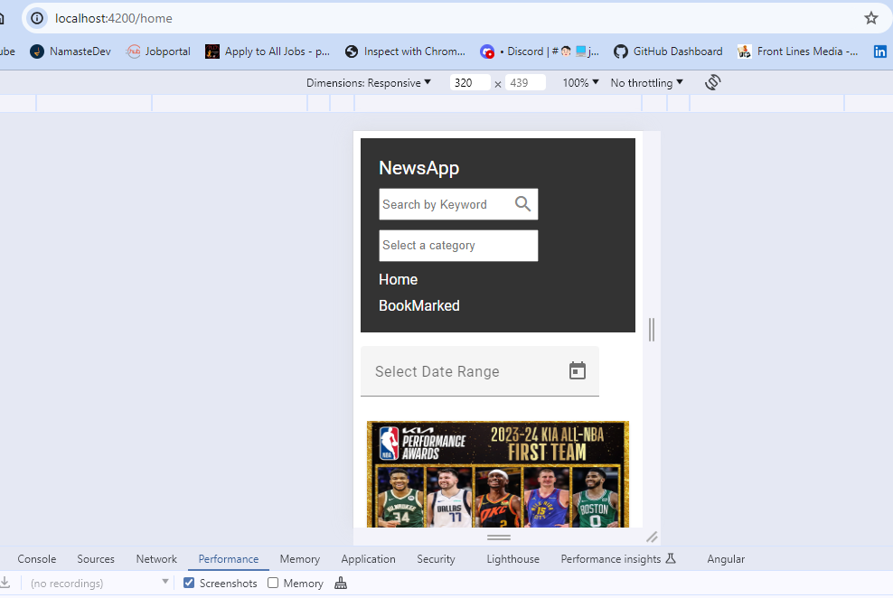
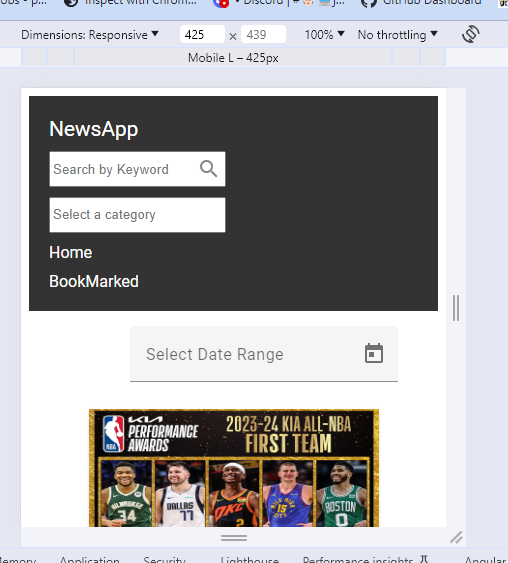
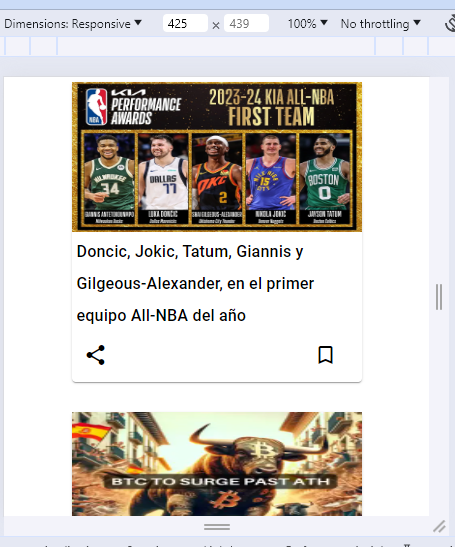
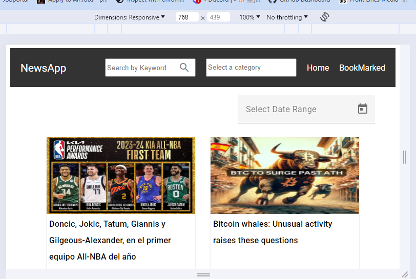
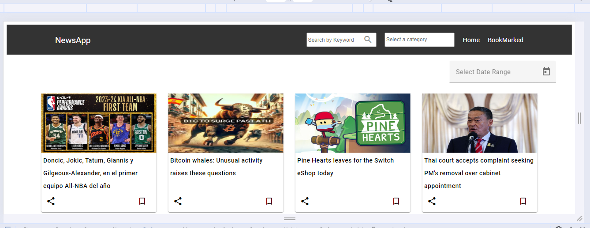

# Page Refresh and Pagination
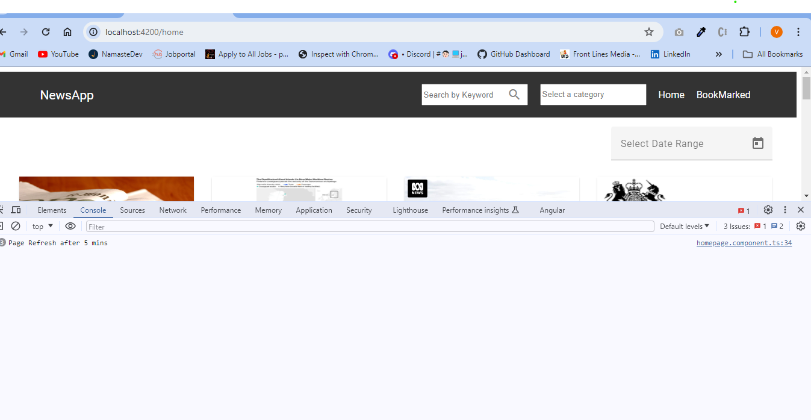
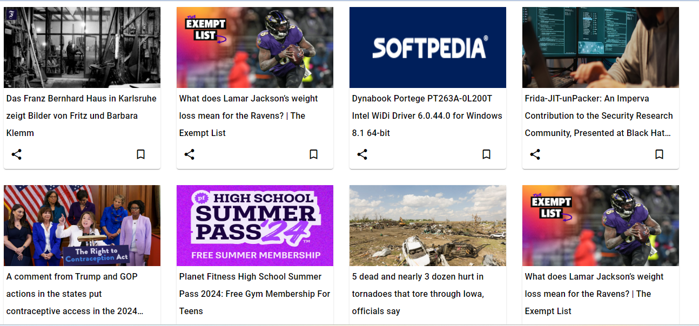

# Share option
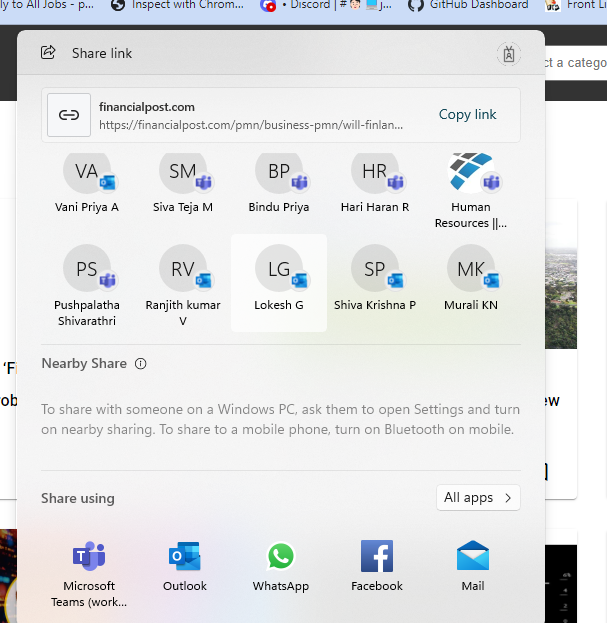

# Newsapp - Responsivevideo.mp4

